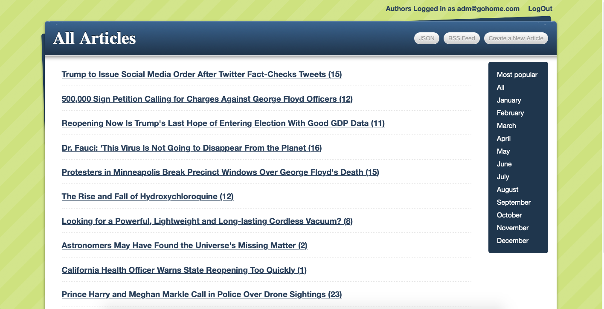

# Blogger Application

<!--
*** Thanks for checking out this README Template. If you have a suggestion that would
*** make this better, please fork the repo and create a pull request or simply open
*** an issue with the tag "enhancement".
*** Thanks again! Now go create something AMAZING! :D
-->

<!-- PROJECT SHIELDS -->
<!--
*** I'm using markdown "reference style" links for readability.
*** Reference links are enclosed in brackets [ ] instead of parentheses ( ).
*** See the bottom of this document for the declaration of the reference variables
*** for contributors-url, forks-url, etc. This is an optional, concise syntax you may use.
*** https://www.markdownguide.org/basic-syntax/#reference-style-links
-->

[![Contributors][contributors-shield]][contributors-url]
[![Forks][forks-shield]][forks-url]
[![Stargazers][stars-shield]][stars-url]
[![Issues][issues-shield]][issues-url]

<!-- PROJECT LOGO -->
<br />
<p align="center">
  <a href="https://github.com/ioanniskousis/blogger">
    
  </a>
  
  <h3 align="center">Blogger Application</h3>
  
  <p align="center">
    This project is part of the Microverse curriculum in Ruby On Rails course!
    <br />
    <a href="https://github.com/ioanniskousis/blogger"><strong>Explore the docs »</strong></a>
    <br />
    <br />
    <a href="https://repl.it/@ioanniskousis/blogger">View Demo</a>
    <a href="https://github.com/ioanniskousis/blogger/issues">Report Bug</a>
    <a href="https://github.com/ioanniskousis/blogger/issues">Request Feature</a>
  </p>
</p>

Blogger is an application which shows articles and users may write comments about them.  


<br />

<br />

<!-- TABLE OF CONTENTS -->

## Table of Contents

- [About the Project](#about-the-project)
- [Application Instructions](#application-instructions)

- [System dependencies](#system-dependencies)
- [Configuration](#configuration)
- [Database creation](#database-creation)
- [Database initialization](#database-initialization)
- [Testing](#testing)
- [Services](#services) <!-- (job queues, cache servers, search engines, etc.) -->
- [Deployment instructions](#deployment-instructions)

- [Development](#development)

- [Built With](#built-with)
- [Live Version](#live-version)
- [Acknowledgements](#acknowledgements)
- [License](#license)

<!-- ABOUT THE PROJECT -->

## About The Project  

 The project uses a SQLite database which holds the following tables:
    - Articles 
      - Fields : Title, Body, Creation Date, Update Date, View Counts, Image Info
    - Comments
      - Fields : Author, Body
    - Tags
      - Fields : Name
    - Taggings
      - Fields : Reference To Articles, Reference To Tags
    - Authors
      - Fields : Name, email, password

Each Article is linked to a number of comments and a number of tags.  
A user must perform a login in order to create an article, add comments or update an article.  

<hr/>

### Initial Screen
  The initial screen shows a list of all articles.  
  Users may apply filter to view popular articles and grouped by month.  
  Clicking on the relevant buttons on the top, the user may show RSS feed and JSON formated output of all articles.  

### Article View
  Clicking an article title from the initial list shows the details of that article.  
  This view allows to delete or edit the article and also to add comments.  


<!-- ABOUT THE PROJECT -->
## Application Instructions  


## Development
  * Clone the project
  ```
  https://github.com/ioanniskousis/blogger.git
  ``` 

## Testing
 

### Built With

This project was built using these technologies.

  - Ruby version 2.6
  - Ruby On Rails version 6.0

### System dependencies


<!-- LIVE VERSION -->

## Live version

  You can see it working [](https://repl.it/@ioanniskousis/blogger)

<!-- CONTACT -->

## Contributors

:bust_in_silhouette: **Author_1**
​## Ioannis Kousis

- Github: [@ioanniskousis](https://github.com/ioanniskousis)
- Twitter: [@ioanniskousis](https://twitter.com/ioanniskousis)
- Linkedin: [Ioannis Kousis](https://www.linkedin.com/in/ioannis-kousis-9a5051b4/)
- E-mail: jgkousis@gmail.com

:bust_in_silhouette: **Author_2**
​## Eric Mbouwe

- Github: [@ericmbouwe](https://github.com/ericmbouwe)
- Twitter: [@ericmbouwe](https://twitter.com/ericmbouwe)
- Linkedin: [Eric Mbouwe](https://www.linkedin.com/in/ericmbouwe/)
- E-mail: ericmbouwe@gmail.com

<!-- ACKNOWLEDGEMENTS -->

## Acknowledgements

  - [Microverse](https://www.microverse.org/)
  - [The Odin Project](https://www.theodinproject.com/)
  - [Ruby Documentation](https://www.ruby-lang.org/en/documentation/)

<!-- MARKDOWN LINKS & IMAGES -->
<!-- https://www.markdownguide.org/basic-syntax/#reference-style-links -->

[contributors-shield]: https://img.shields.io/github/contributors/ioanniskousis/blogger.svg?style=flat-square
[contributors-url]: https://github.com/ioanniskousis/blogger/graphs/contributors
[forks-shield]: https://img.shields.io/github/forks/ioanniskousis/blogger.svg?style=flat-square
[forks-url]: https://github.com/ioanniskousis/blogger/network/members
[stars-shield]: https://img.shields.io/github/stars/ioanniskousis/blogger.svg?style=flat-square
[stars-url]: https://github.com/ioanniskousis/blogger/stargazers
[issues-shield]: https://img.shields.io/github/issues/ioanniskousis/blogger.svg?style=flat-square
[issues-url]: https://github.com/ioanniskousis/blogger/issues

<!-- LICENSE -->

## License

📝
This project is [MIT](https://opensource.org/licenses/MIT) licensed.
